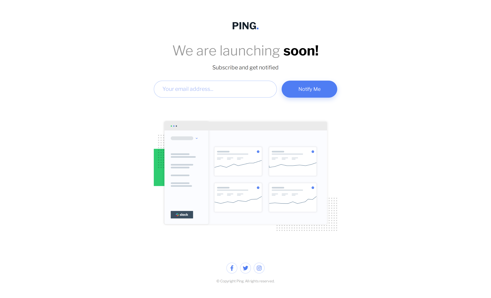

# Frontend Mentor - Ping coming soon page solution

This is a solution to the [Ping coming soon page challenge on Frontend Mentor](https://www.frontendmentor.io/challenges/ping-single-column-coming-soon-page-5cadd051fec04111f7b848da). Frontend Mentor challenges help you improve your coding skills by building realistic projects. 

## Table of contents

- [Overview](#overview)
  - [Screenshot](#screenshot)
  - [Links](#links)
- [My process](#my-process)
  - [Built with](#built-with)
  - [Continued development](#continued-development)
  - [Useful resources](#useful-resources)
- [Author](#author)

### Screenshot

### Links

- Solution URL: [Github repo](https://github.com/SilverWings47/ping-coming-soon-page)
- Live Site URL: [Live site URL](https://app.netlify.com/sites/gleeful-valkyrie-5913b3/overview)

### Built with

- Semantic HTML5 markup
- CSS custom properties
- Sass
- Flexbox
- CSS Grid
- Mobile-first workflow

**Note: These are just examples. Delete this note and replace the list above with your own choices**

### Continued development

I still have to work on the array methods and Regular expressions.

### Useful resources

- [MDN](https://developer.mozilla.org/) - This is an amazing website which helped me in this project. I'd recommend it to anyone still learning web dev.
- [W3Schools](https://www.w3schools.com/) - This is an amazing website which helped me in this project. I'd recommend it to anyone still learning web dev.

## Author

- Frontend Mentor - [@SilverWings47](https://www.frontendmentor.io/profile/SilverWings47)
- Twitter - [@SilverWings47](https://www.twitter.com/iSilverWings)
